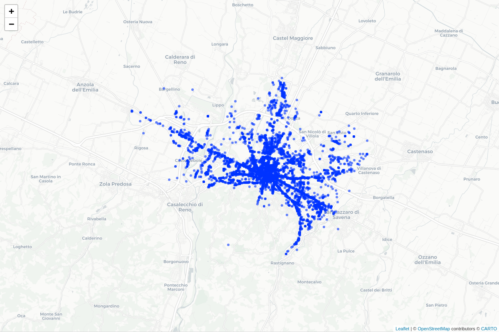
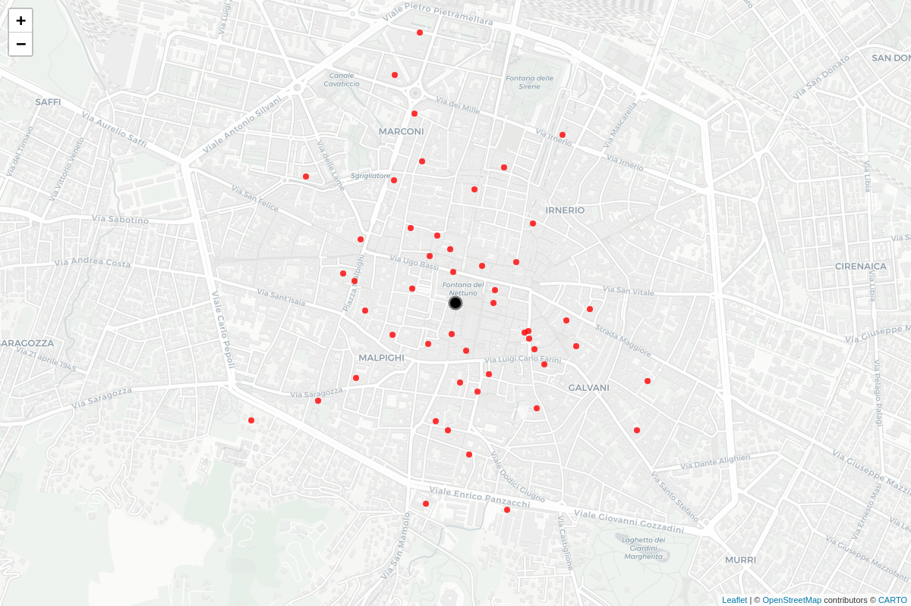
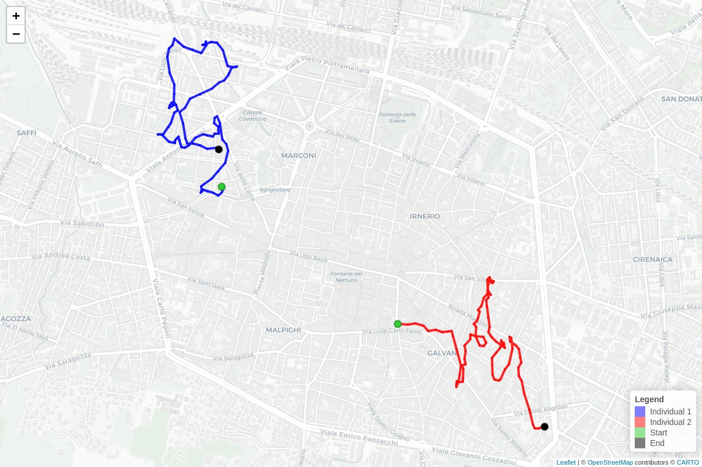
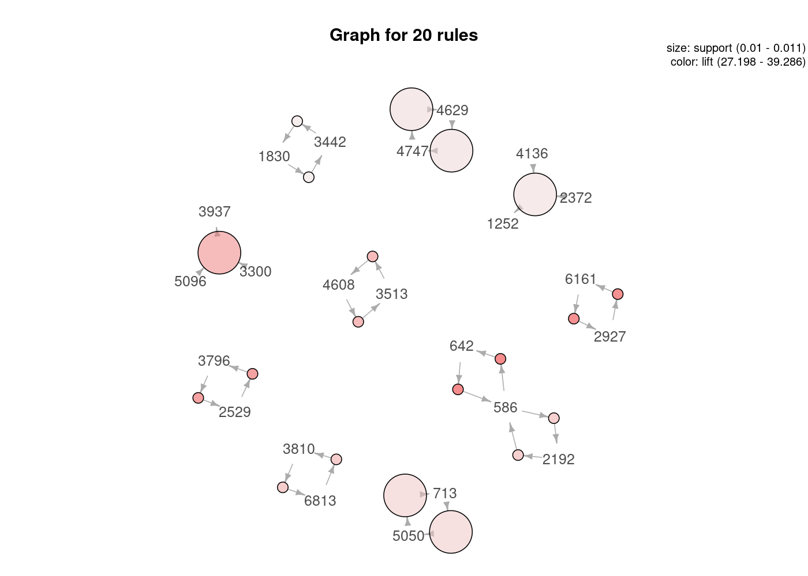
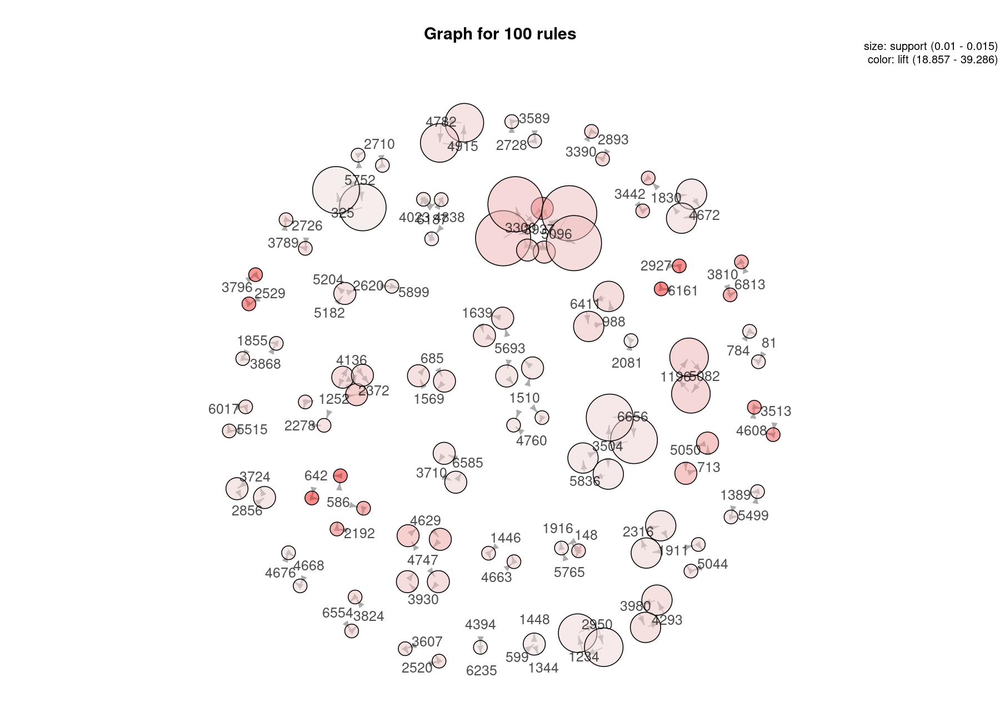
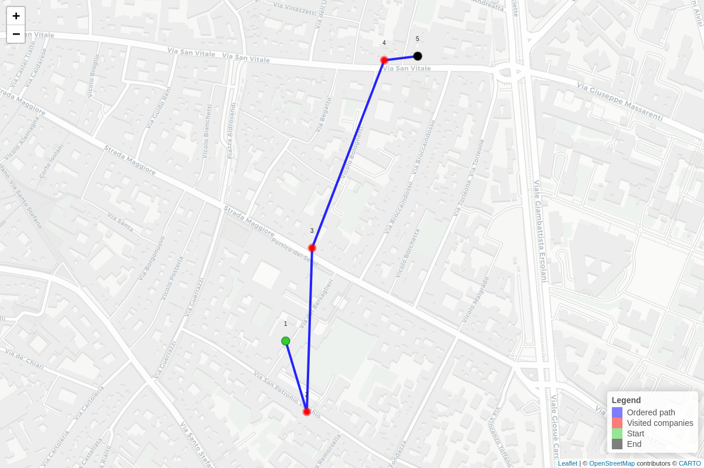
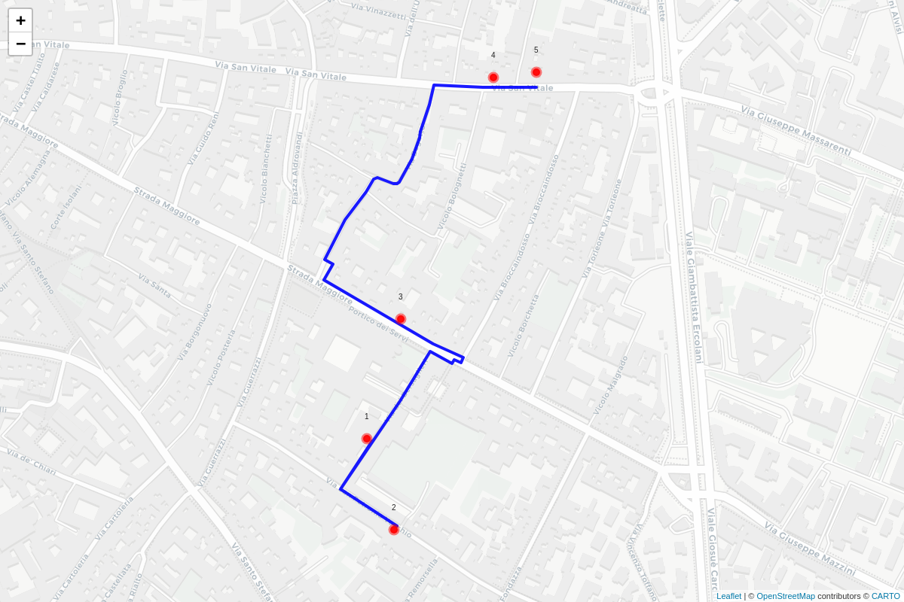
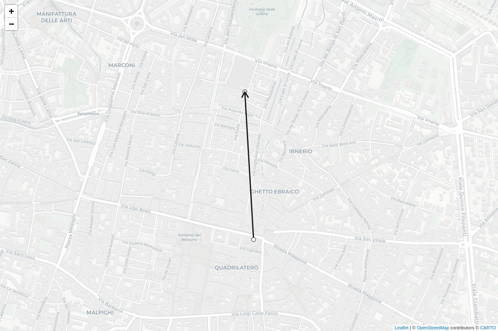

Spatial unsupervised learning – applications of market basket analysis
in geomarketing - 2026 update
================
Alessandro Festi
April 2026

- [Repository structure](#repository-structure)
- [How to reproduce the README](#how-to-reproduce-the-readme)
- [1. Input data](#1-input-data)
- [2. Simulating individual centres and
  paths](#2-simulating-individual-centres-and-paths)
- [3. Matching simulated points with commercial
  activities](#3-matching-simulated-points-with-commercial-activities)
- [4. Spatial association rules](#4-spatial-association-rules)
- [5. Ordered paths and sequential spatial association
  rules](#5-ordered-paths-and-sequential-spatial-association-rules)
- [6. Notes on interpretation](#6-notes-on-interpretation)

<br/>

<font size = '2'> Market basket analysis is a widely employed technique
in marketing that provides suggestions of products to buy to a customer,
given the past purchases made by customers, based on the statistical
methodology of association rules.

This repository contains the updated and fully reproducible R workflow
used for the Chapter of the book. The idea is to extend market basket
analysis from products to geolocated points: the items are not products
in a receipt, but commercial activities matched to simulated individual
paths in the city of Bologna.

The 2026 update also adds the sequential part of the analysis, where the
order of matched activities inside each path is preserved and used to
extract sequential spatial association rules. </font>

<br/>

For the comprehensive analysis read:

- In English: *XXX* (XXX, XXX)

<br/>

The full code is contained in `model_code.R`. The dataset of commercial
activities has to be placed in the `data/` folder as `commercials.csv`.
All tabular outputs are written in `outputs/`, while all figures used
below are written in `Images/`.

## Repository structure

``` text
Spatial-unsupervised-learning-applications-of-market-basket-analysis-in-geomarketing-2026update/
├── README.Rmd
├── README.md
├── config.Rproj
├── model_code.R
├── data/
│   └── commercials.csv
├── outputs/
└── Images/
```

## How to reproduce the README

Run the analysis first, then render the README.

``` r
source("model_code.R")

rmarkdown::render(
  input = "README.Rmd",
  output_format = "github_document",
  output_file = "README.md"
)
```

This is important: `model_code.R` creates the CSV files and figures;
`README.Rmd` reads those files and prints a clean `head(5)` of each
output.

<br/>

# 1. Input data

The input dataset contains the commercial activities in Bologna. In the
previous version of the project, coordinates had to be obtained through
geocoding. In the updated version, latitude and longitude are already
available in the input file.

``` r
commercial_activities <- read.csv(
  file.path("data", "commercials.csv"),
  stringsAsFactors = FALSE,
  fileEncoding = "UTF-8"
)

colnames(commercial_activities) <- trimws(colnames(commercial_activities))
colnames(commercial_activities) <- gsub("\\.+", "_", colnames(commercial_activities))

if ("Latitudine" %in% names(commercial_activities)) {
  names(commercial_activities)[names(commercial_activities) == "Latitudine"] <- "lat"
}

if ("Longitudine" %in% names(commercial_activities)) {
  names(commercial_activities)[names(commercial_activities) == "Longitudine"] <- "lon"
}

commercial_activities <- commercial_activities %>%
  filter(!is.na(lat), !is.na(lon)) %>%
  mutate(indexed_company = row_number())
```

**Output file:** `outputs/output_11_0_commercial_activities_preview.csv`

| Ubicazione | Quartiere | Zona | Sottoarea | lat | lon | AttivitÃ_prevalente | Row_Number | indexed_company | matched_idx |
|:---|:---|:---|:---|---:|---:|:---|---:|---:|---:|
| VIA AUGUSTO MURRI, 191/A | Santo Stefano | Murri | Esercizi di vicinato | 44.47353 | 11.36860 | Abbigliamento | 1 | 1 | 1 |
| VIA GIACOMO MATTEOTTI, 22/B | Navile | Bolognina | Esercizi di vicinato | 44.50863 | 11.34644 | Abbigliamento | 2 | 2 | 2 |
| VIA MASCARELLA, 102 | Santo Stefano | Irnerio | Phone center/Internet point | 44.50123 | 11.35165 | Schede telefoniche telefoni cellulari | 3 | 3 | 3 |
| VIA ANDREA COSTA, 39/D | Porto - Saragozza | Costa Saragozza | Esercizi di vicinato | 44.49511 | 11.32571 | Gelati torte semifreddi | 4 | 4 | 4 |
| VIA ALCESTE GIOVANNINI, 5/1 | Navile | Bolognina | Esercizi di vicinato | 44.51786 | 11.33933 | Pane - pasticceria - dolciumi | 5 | 5 | 5 |

Preview of commercial activities

**Figure 11.6. Commercial activities used for spatial matching**

<p align="center">

</p>

<br/>

# 2. Simulating individual centres and paths

Individual centres are generated around Palazzo d’Accursio, which is
used as the reference point for the city centre of Bologna. The updated
analysis uses 50 simulated individuals, 20 paths per individual and 100
ordered locations per path.

``` r
n_individuals <- 50
n_paths <- 20
n_locations <- 100

palazzo_accursio_latitude <- 44.493674
palazzo_accursio_longitude <- 11.342220

variability_constant <- 200
correlation <- 0.7
step_scale <- 0.0003

individual_centres <- data.frame(
  lon = rnorm(n_individuals, mean = 0, sd = 1) / variability_constant + palazzo_accursio_longitude,
  lat = rnorm(n_individuals, mean = 0, sd = 1) / variability_constant + palazzo_accursio_latitude
)
```

**Output file:** `outputs/output_11_0_individual_centres_preview.csv`

|      lon |      lat |
|---------:|---------:|
| 11.33379 | 44.49880 |
| 11.34641 | 44.49225 |
| 11.34299 | 44.48757 |
| 11.33653 | 44.49458 |
| 11.34849 | 44.49298 |

Preview of simulated individual centres

**Figure 11.4. Simulated individual centres**

<p align="center">

</p>

Then the individual paths are simulated. The multivariate normal
distribution is used to generate serially correlated spatial increments
within each path. The cumulative sum of these increments produces an
ordered individual path.

``` r
generate_paths <- function(individual_centres,
                           n_paths,
                           n_locations,
                           correlation = 0.7,
                           step_scale = 0.0003) {
  time_index <- seq_len(n_locations)
  sigma_time <- outer(time_index, time_index, function(i, j) correlation^abs(i - j))
  all_paths <- vector("list", length = nrow(individual_centres))

  for (j in seq_len(nrow(individual_centres))) {
    individual_paths <- vector("list", length = n_paths)

    for (i in seq_len(n_paths)) {
      start_lon <- individual_centres$lon[j] + rnorm(1, 0, step_scale * 1.5)
      start_lat <- individual_centres$lat[j] + rnorm(1, 0, step_scale * 1.5)

      delta_lon <- as.numeric(
        MASS::mvrnorm(n = 1, mu = rep(0, n_locations), Sigma = sigma_time)
      ) * step_scale

      delta_lat <- as.numeric(
        MASS::mvrnorm(n = 1, mu = rep(0, n_locations), Sigma = sigma_time)
      ) * step_scale

      individual_paths[[i]] <- data.frame(
        Longitude = start_lon + cumsum(delta_lon),
        Latitude = start_lat + cumsum(delta_lat),
        Individual_ID = j,
        Path_ID = i,
        Location_ID = seq_len(n_locations)
      )
    }

    all_paths[[j]] <- dplyr::bind_rows(individual_paths)
  }

  dplyr::bind_rows(all_paths)
}
```

**Output file:** `outputs/output_11_1_paths_head.csv`

| Longitude | Latitude | Individual_ID | Path_ID | Location_ID |
|----------:|---------:|--------------:|--------:|------------:|
|  11.33349 | 44.49898 |             1 |       1 |           1 |
|  11.33357 | 44.49911 |             1 |       1 |           2 |
|  11.33366 | 44.49894 |             1 |       1 |           3 |
|  11.33352 | 44.49868 |             1 |       1 |           4 |
|  11.33326 | 44.49854 |             1 |       1 |           5 |

Preview of simulated paths

**Figure 11.5. Two simulated paths for two simulated individuals**

<p align="center">

</p>

<br/>

# 3. Matching simulated points with commercial activities

The simulated locations are matched to the closest commercial activity.
A match is retained only when the nearest activity is within 25 metres.
The operation does not imply a verified visit or purchase: it only means
that a simulated path point is spatially close enough to a known
activity.

``` r
max_match_distance_km <- 0.025

assign_nearest_activity <- function(path.m, activity.m, max_match_distance_km = 0.025) {
  matched_points <- data.frame(
    distance_km = numeric(nrow(path.m)),
    matched_idx = rep(NA_integer_, nrow(path.m)),
    matched_lon = rep(NA_real_, nrow(path.m)),
    matched_lat = rep(NA_real_, nrow(path.m))
  )

  for (j in seq_len(nrow(path.m))) {
    distance_vector <- sp::spDistsN1(
      pts = activity.m,
      pt = path.m[j, ],
      longlat = TRUE
    )

    nearest_idx <- which.min(distance_vector)
    nearest_distance <- distance_vector[nearest_idx]

    matched_points$distance_km[j] <- nearest_distance

    if (nearest_distance < max_match_distance_km) {
      matched_points$matched_idx[j] <- nearest_idx
      matched_points$matched_lon[j] <- activity.m[nearest_idx, 1]
      matched_points$matched_lat[j] <- activity.m[nearest_idx, 2]
    }
  }

  matched_points
}
```

**Output file:** `outputs/output_11_2_matched_data_preview.csv`

| Individual_ID | Path_ID | Location_ID | itemset_id | indexed_company | activity_lon | activity_lat | distance_km |
|---:|---:|---:|:---|---:|---:|---:|---:|
| 1 | 1 | 4 | 1_1 | 4191 | 11.33350 | 44.49872 | 0.0049461 |
| 1 | 1 | 6 | 1_1 | 5968 | 11.33282 | 44.49885 | 0.0185778 |
| 1 | 1 | 7 | 1_1 | 5445 | 11.33218 | 44.49869 | 0.0204778 |
| 1 | 1 | 8 | 1_1 | 5445 | 11.33218 | 44.49869 | 0.0147203 |
| 1 | 1 | 9 | 1_1 | 2884 | 11.33181 | 44.49874 | 0.0140423 |

Preview of matched dataset

<br/>

# 4. Spatial association rules

The matched data are transformed into a transaction dataset. Each basket
corresponds to one simulated path, identified by `itemset_id`. The items
are the indexed commercial activities matched along that path.

``` r
basket_data <- matched_data %>%
  select(
    itemset_id,
    Individual_ID,
    Path_ID,
    indexed_company,
    lon = activity_lon,
    lat = activity_lat,
    distance_km,
    Location_ID
  ) %>%
  distinct(itemset_id, indexed_company, .keep_all = TRUE)

transaction_data <- basket_data %>%
  group_by(itemset_id) %>%
  summarise(
    items = paste(indexed_company, collapse = ","),
    .groups = "drop"
  )

transaction_list <- strsplit(transaction_data$items, ",")
transactions <- as(transaction_list, "transactions")
```

**Output file:** `outputs/output_11_3_basket_data_preview.csv`

| itemset_id | Individual_ID | Path_ID | indexed_company | lon | lat | distance_km | Location_ID |
|:---|---:|---:|---:|---:|---:|---:|---:|
| 1_1 | 1 | 1 | 4191 | 11.33350 | 44.49872 | 0.0049461 | 4 |
| 1_1 | 1 | 1 | 5968 | 11.33282 | 44.49885 | 0.0185778 | 6 |
| 1_1 | 1 | 1 | 5445 | 11.33218 | 44.49869 | 0.0204778 | 7 |
| 1_1 | 1 | 1 | 2884 | 11.33181 | 44.49874 | 0.0140423 | 9 |
| 1_1 | 1 | 1 | 2132 | 11.33246 | 44.49901 | 0.0213437 | 13 |

Preview of basket dataset

**Output file:** `outputs/output_11_4_transaction_data_preview.csv`

| itemset_id | items |
|:---|:---|
| 10_1 | 2399,2266,166,3310,661,3213,5707,133,370,199,183,1337,3710,1234,1943,2829,999,6086,397,850,141,412,3589,2728,3772,3446,5756,3061,5835,3995,3159,2999,438,506,803,6421,3558,476,1487,3836 |
| 10_10 | 541,4770,383,620,42,3226,3033,4896,1928,3380,5997,3407,3512,5365 |
| 10_11 | 4380,6470,2149,4925,5207,3593,4565,2399,3063,2634,2851,541,829,2230,4655,4285,2266,4970,3159,3995,4744,5756,5825,3606,5233,999,2156,1997,1385,1197,3049,4916,2788,1830,3657,1234,2950,2383,3153,3039,4778,878,1164,3531,922,202,4736,3761,2814 |
| 10_12 | 4925,6000,1385,3153,6131,5056,1855,3868,1956,911,2324,6030,1547,5293,2464,4151,1854,943,4760,6221,6179,29,4254,5765,972,4188,587,4921,275 |
| 10_13 | 2634,2402,582,3310,3063,5779,4970,5756,3446,1943,3657,2469,3772,412,141,4573,5233,2394,4380,808,1539,2853,1400,4144,4841,744,3871,218,202,4958,570,4805,2039,5952,875,1240,1395,1951,4717,1726,5815,1547,325,5818,3106,6294,2279,5966 |

Preview of transaction dataset

Performing the Market Basket Analysis through the Apriori algorithm:

``` r
association_rules <- apriori(
  transactions,
  parameter = list(
    supp = 0.01,
    conf = 0.30,
    minlen = 2,
    maxlen = 4
  )
)
```

**Output file:** `outputs/output_11_5_top_spatial_rules.csv`

| rules             |   support | confidence |  coverage |      lift | count |
|:------------------|----------:|-----------:|----------:|----------:|------:|
| {1631} =\> {5204} | 0.0252525 |  0.4310345 | 0.0585859 |  7.232613 |    25 |
| {5204} =\> {1631} | 0.0252525 |  0.4237288 | 0.0595960 |  7.232613 |    25 |
| {1951} =\> {1631} | 0.0232323 |  0.5000000 | 0.0464646 |  8.534483 |    23 |
| {1631} =\> {1951} | 0.0232323 |  0.3965517 | 0.0585859 |  8.534483 |    23 |
| {541} =\> {2399}  | 0.0212121 |  0.6363636 | 0.0333333 | 10.000000 |    21 |

Top spatial association rules

A summary of the extracted spatial association rules provides an
overview of their number, structure and quality measures.

**Summary of extracted spatial association rules**

set of 887 rules

rule length distribution (lhs + rhs):sizes 2 3 851 36

Min. 1st Qu. Median Mean 3rd Qu. Max. 2.000 2.000 2.000 2.041 2.000
3.000

summary of quality measures: support confidence coverage lift count  
Min. :0.01010 Min. :0.3000 Min. :0.01111 Min. : 4.751 Min. :10.00  
1st Qu.:0.01010 1st Qu.:0.3548 1st Qu.:0.02424 1st Qu.: 9.811 1st
Qu.:10.00  
Median :0.01111 Median :0.4074 Median :0.03030 Median :12.446 Median
:11.00  
Mean :0.01247 Mean :0.4302 Mean :0.03028 Mean :13.299 Mean :12.34  
3rd Qu.:0.01414 3rd Qu.:0.4815 3rd Qu.:0.03485 3rd Qu.:15.752 3rd
Qu.:14.00  
Max. :0.02525 Max. :0.9091 Max. :0.06364 Max. :39.286 Max. :25.00

mining info: data ntransactions support confidence transactions 990 0.01
0.3 call apriori(data = transactions, parameter = list(supp = 0.01, conf
= 0.3, minlen = 2, maxlen = 4))

Graph representation of the strongest spatial association rules.

**Figure 11.9a. Association rules graph using the top 20 rules**

<p align="center">

</p>

**Figure 11.9b. Association rules graph using the top 100 rules**

<p align="center">

</p>

<br/>

# 5. Ordered paths and sequential spatial association rules

Traditional spatial association rules ignore the order in which
locations are encountered. In order to introduce sequential information,
each path is ordered according to the first occurrence of each matched
commercial activity. The resulting sequence is still simulated and does
not contain real timestamps; therefore, the sequential information
should be interpreted as ordered information within each path.

``` r
sequence_data <- matched_data %>%
  arrange(Individual_ID, Path_ID, Location_ID) %>%
  group_by(itemset_id, indexed_company) %>%
  summarise(
    first_location_id = min(Location_ID),
    lon = first(activity_lon),
    lat = first(activity_lat),
    .groups = "drop"
  ) %>%
  separate(
    itemset_id,
    into = c("individual_chr", "path_chr"),
    sep = "_",
    remove = FALSE
  ) %>%
  mutate(
    individual_num = as.integer(individual_chr),
    path_num = as.integer(path_chr)
  ) %>%
  arrange(individual_num, path_num, first_location_id) %>%
  group_by(itemset_id, individual_num, path_num) %>%
  mutate(
    order_in_path = row_number(),
    sequenceID = cur_group_id()
  ) %>%
  ungroup()
```

**Output file:** `outputs/output_11_6_sequence_preview.csv`

| itemset_id | indexed_company | first_location_id | lon | lat | order_in_path | sequenceID |
|:---|---:|---:|---:|---:|---:|---:|
| 1_1 | 4191 | 4 | 11.33350 | 44.49872 | 1 | 201 |
| 1_1 | 5968 | 6 | 11.33282 | 44.49885 | 2 | 201 |
| 1_1 | 5445 | 7 | 11.33218 | 44.49869 | 3 | 201 |
| 1_1 | 2884 | 9 | 11.33181 | 44.49874 | 4 | 201 |
| 1_1 | 2132 | 13 | 11.33246 | 44.49901 | 5 | 201 |

Preview of ordered sequence dataset

**Figure 11.7. Representative ordered path**

<p align="center">

</p>

The same ordered path can also be projected onto the pedestrian road
network using OSRM/OpenStreetMap. The order is not changed by OSRM; OSRM
is used only for visualisation of the connections between already
ordered points.

**Figure 11.8. Ordered path projected onto the pedestrian road network**

<p align="center">

</p>

The ordered dataset is converted into the basket format required by
`arulesSequences`.

``` r
sequence_input <- sequence_data %>%
  arrange(sequenceID, order_in_path) %>%
  transmute(
    sequenceID = sequenceID,
    eventID = order_in_path,
    SIZE = 1,
    items = as.character(indexed_company)
  )

tmp_sequence_file <- tempfile(fileext = ".txt")

write.table(
  sequence_input,
  file = tmp_sequence_file,
  sep = " ",
  row.names = FALSE,
  col.names = FALSE,
  quote = FALSE
)

sequence_transactions <- read_baskets(
  con = tmp_sequence_file,
  info = c("sequenceID", "eventID", "SIZE")
)
```

**Output file:** `outputs/output_11_7_sequence_input_preview.csv`

| sequenceID | eventID | SIZE | items |
|-----------:|--------:|-----:|------:|
|          1 |       1 |    1 |  2399 |
|          1 |       2 |    1 |  2266 |
|          1 |       3 |    1 |   166 |
|          1 |       4 |    1 |  3310 |
|          1 |       5 |    1 |   661 |

Preview of sequence input for arulesSequences

Sequential spatial rules are then extracted using `cspade()` and
`ruleInduction()`.

``` r
sequential_patterns <- cspade(
  sequence_transactions,
  parameter = list(support = 0.005),
  control = list(verbose = TRUE)
)

sequential_rules <- ruleInduction(
  sequential_patterns,
  confidence = 0.15
)

top_sequential_rules_by_confidence <- sort(
  sequential_rules,
  by = "confidence",
  decreasing = TRUE
) %>%
  head(5)

top_sequential_rules_by_confidence_df <- as(
  top_sequential_rules_by_confidence,
  "data.frame"
)
```

If we inspect the rules by confidence, we can also notice patterns
composed of more than two activities or multiple ordered events.

**Output file:**
`outputs/output_11_8a_top_sequential_rules_by_confidence.csv`

| rule                             |   support | confidence |     lift |
|:---------------------------------|----------:|-----------:|---------:|
| \<{4879}\> =\> \<{2812}\>        | 0.0060606 |  1.0000000 | 99.00000 |
| \<{1569},{685}\> =\> \<{3651}\>  | 0.0050505 |  0.8333333 | 41.25000 |
| \<{3969}\> =\> \<{1631}\>        | 0.0050505 |  0.8333333 | 14.22414 |
| \<{3371}\> =\> \<{4136}\>        | 0.0060606 |  0.7500000 | 20.62500 |
| \<{4956},{5765}\> =\> \<{1916}\> | 0.0060606 |  0.7500000 | 27.50000 |

Top sequential spatial rules sorted by confidence

**Output file:** `outputs/output_11_8_top_sequential_rules.csv`

| rule                      |   support | confidence |     lift | lhs_id | rhs_id |
|:--------------------------|----------:|-----------:|---------:|-------:|-------:|
| \<{4879}\> =\> \<{2812}\> | 0.0060606 |  1.0000000 | 99.00000 |   4879 |   2812 |
| \<{3969}\> =\> \<{1631}\> | 0.0050505 |  0.8333333 | 14.22414 |   3969 |   1631 |
| \<{3371}\> =\> \<{4136}\> | 0.0060606 |  0.7500000 | 20.62500 |   3371 |   4136 |
| \<{5758}\> =\> \<{3099}\> | 0.0050505 |  0.7142857 | 29.46429 |   5758 |   3099 |
| \<{881}\> =\> \<{4956}\>  | 0.0070707 |  0.7000000 | 17.32500 |    881 |   4956 |

Top simple one-to-one sequential spatial rules

The following figure maps only simple one-to-one sequential rules, where
a single activity on the left-hand side points to a single activity on
the right-hand side.

**Figure 11.10. Map of one-to-one sequential spatial rules**

<p align="center">

</p>

<br/>

# 6. Notes on interpretation

The analysis is based on simulated paths and should therefore be
interpreted as a methodological demonstration. The matched activities
are not verified visits: they are activities located within a predefined
spatial threshold from simulated path points. Similarly, the sequential
analysis uses the order of points within each simulated path, not real
timestamps. The main objective is to show how spatial market basket
analysis and sequential spatial association rules can be implemented in
a reproducible R workflow.
